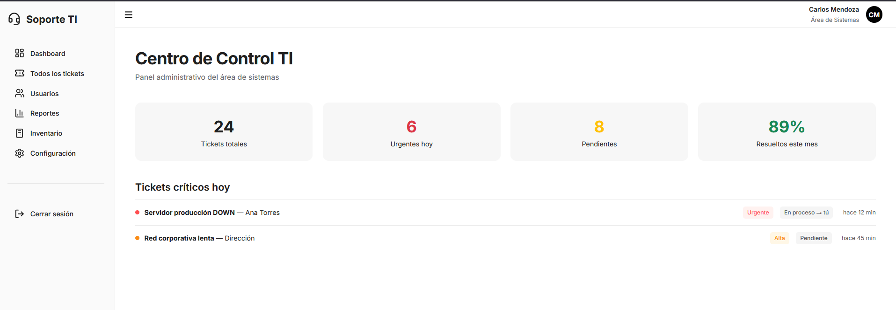
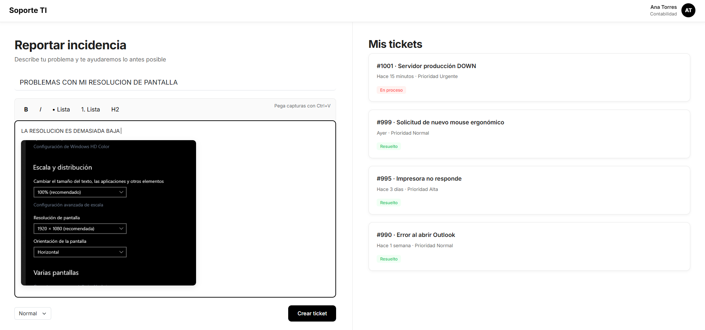
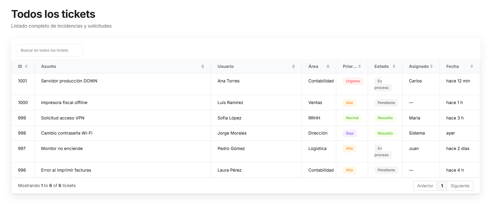

# Soporte TI – Sistema de Tickets Interno
## **(SISTEMA EN DESARROLLO)**



Sistema interno de gestión de incidencias TI – 2025  
**Diseñado y desarrollado por Moisés Valencia**

## Características principales

- Login minimalista con fondo perla animado
- Editor estilo Notion (pegar imágenes con Ctrl+V)
- Tabla dinámica con Grid.js (ordenar, filtrar, redimensionar)
- Dashboard con estadísticas en tiempo real
- Reportes mensuales automáticos
- 100% responsive y modo oscuro listo

## Generación de Tickets



## Vista de Tickets 


## Tecnologías usadas

| Tecnología     | Versión | Uso                          |
|----------------|---------|------------------------------|
| PHP            | 8.2+    | Backend y lógica             |
| MySQL          | 8.0+    | Base de datos                |
| Grid.js        | 6.x     | Tablas dinámicas             |
| Quill.js       | 2.0     | Editor de texto rico         |
| Bootstrap 5    | 5.3     | Diseño responsive            |
| Lucide Icons   | latest  | Iconos modernos              |

## Instalación rápida

```bash
git clone https://github.com/tuusuario/soporte-ti.git
cd soporte-ti
# Importa el archivo database.sql
php -S localhost:8000 -t public
```

## Soporte

El sistema es una demo o template por el momento, pero si quieres ayudarme a desarrollarlo contactame en:
Correo: moisesrobertov@gmail.com

